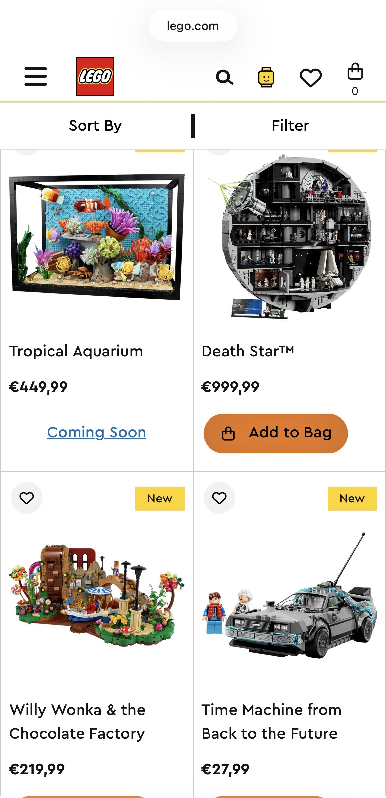
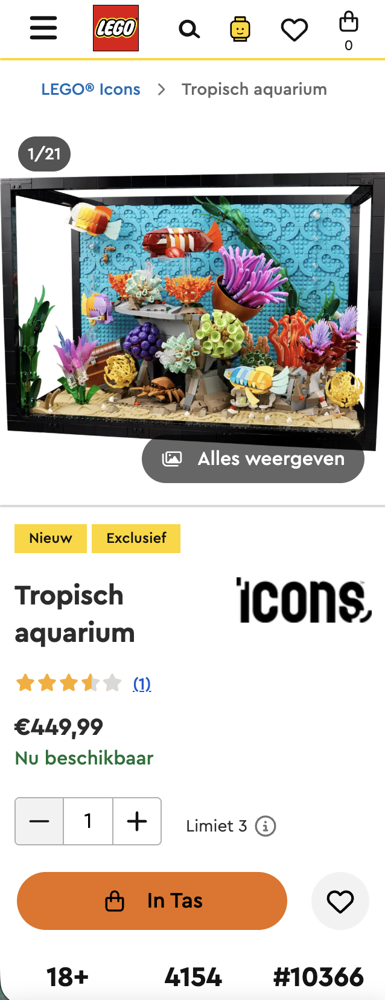
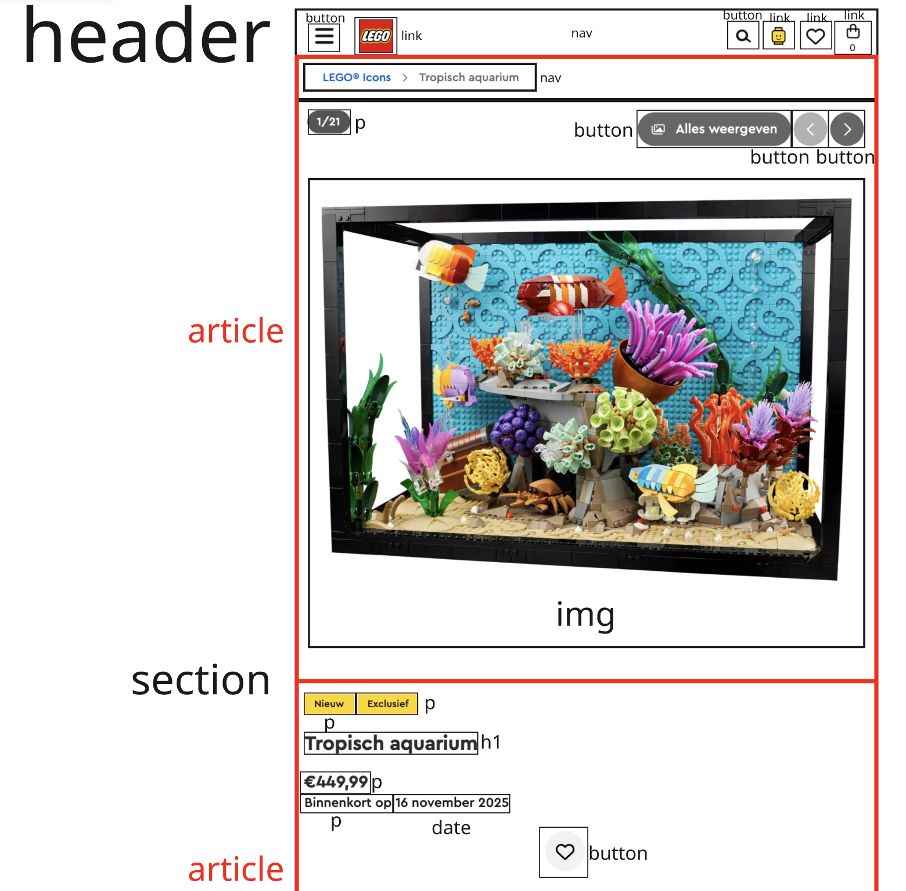
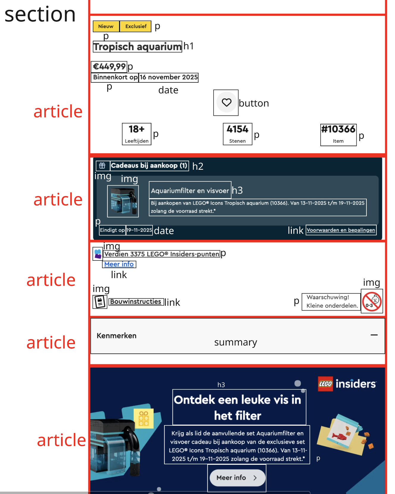
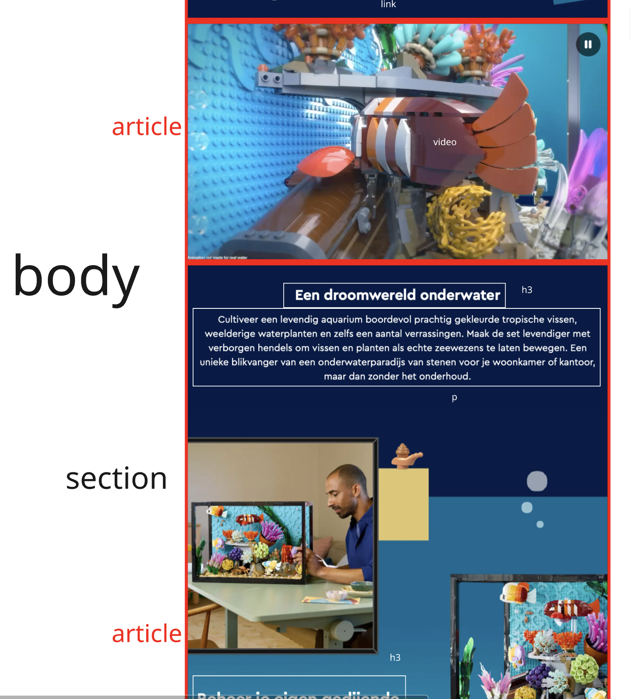
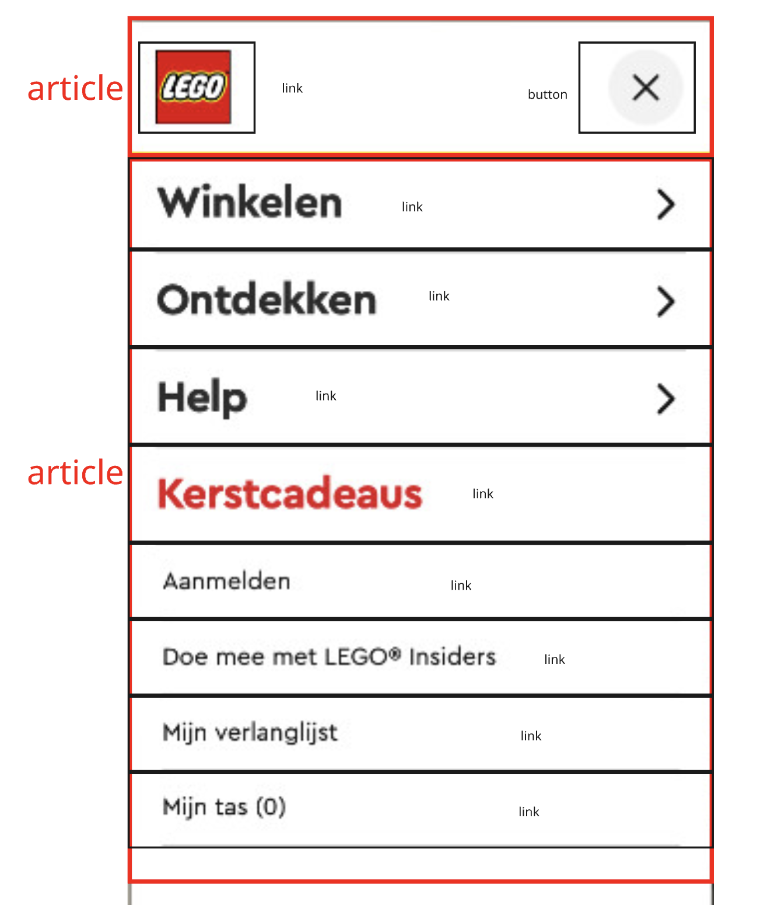

# Procesverslag
Markdown is een simpele manier om HTML te schrijven.  
Markdown cheat cheet: [Hulp bij het schrijven van Markdown](https://github.com/adam-p/markdown-here/wiki/Markdown-Cheatsheet).

Nb. De standaardstructuur en de spartaanse opmaak van de README.md zijn helemaal prima. Het gaat om de inhoud van je procesverslag. Besteedt de tijd voor pracht en praal aan je website.

Nb. Door *open* toe te voegen aan een *details* element kun je deze standaard open zetten. Fijn om dat steeds voor de relevante stuk(ken) te doen.

## Jij

  
uitwerken voor kick-off werkgroep

  ### Auteur:
  Frank van der Schaft

  #### Je startniveau:
  Rood

  #### Je focus:
  Surface plane
 

## Je website

  
uitwerken voor kick-off werkgroep

  ### Je opdracht:
  <a href="https://www.lego.com/nl-nl">LEGO.com</a>

  #### Screenshot(s) van de eerste pagina (small screen): 
  LEGO.com
  

  #### Screenshot(s) van de tweede pagina (small screen):
  LEGO.com 
  
 

## Toegankelijkheidstest 1/2 (week 1)

  
uitwerken na test in 2e werkgroep

  ### Bevindingen
  Lijst met je bevindingen die in de test naar voren kwamen:

  -Links op de artikelenpagina komen dubbel voor met precies dezelfde benaming; 1 voor de afbeelding en 1 voor de set naam. 
  -Alle buttons hebben link tags. 
  -Als alleen het toetsenbord wordt gebruikt om te navigeren, kan alleen de zoekbalk worden geselecteerd. 
  -De website is goed responsive voor mobiel en andere apparaten. 
  -Homepagina heeft geen h1. 
  -Headings van sets komen soms dubbel voor. 
  -Geen van de afbeeldingen hebben alt tekst. 
  -Video's moeten aangeklikt worden om afgespeeld te worden en kunnen gepauzeerd worden, maar er zijn geen captions of transcripts beschikbaar. 
  -Het is niet bij elke link duidelijk of deze inspringt binnen de pagina, een pop-up opent of naar een nieuwe pagina gaat. 
  -Heeft geen high-contrast of light/dark mode. 
  -Tekst wordt niet vergroot. 
  -Website heeft geen grote animaties. 
  -Het kleurencontrast is voldoende en maakt de tekst goed leesbaar. 
  

## Breakdownschets (week 1)

  
uitwerken na afloop 3e werkgroep

  ### de hele pagina: 
  
  
  

  ### dynamisch deel (bijv menu): 
  

## Voortgang 1 (week 2)

  
uitwerken voor 1e voortgang

  ### Stand van zaken
  hier dit ging goed & dit was lastig (neem ook screenshots op van delen van je website en code)

  ### Agenda voor meeting
  samen met je groepje opstellen

  | Frank                      | Rohit              | Lindsy      |
  | ---                        | ---                | ---         |
  | Font krijgen               | -                  | -           |
  | Artikelinformatie opmaken  | -                  | -           |
  | Buttons boven image zetten | -                  | -           |

  ### Verslag van meeting
  hier na afloop snel de uitkomsten van de meeting vastleggen

  - Font downloaden van het internet en in code stoppen met @fontface
  - Artikelinformatie eerst uittekenen en dan in een grid stoppen
  - Buttons bovenop image met position: absolute

## Voortgang 2 (week 3)

  
uitwerken voor 2e voortgang

  ### Stand van zaken
  hier dit ging goed & dit was lastig (neem ook screenshots op van delen van je website en code)

  ### Agenda voor meeting
  samen met je groepje opstellen

  | Frank                            | Daniel          | Jasmijn    |
  | ---                              | ---             | ---        |
  | Producten weergeven (carousel?)  | -               | -          |
  | Achtergrond image overloop       | -               | -          |
  | Dropdown knoppen uitwerking      | -               | -          |
  | SVG kleur veranderen             | -               | -          |
  | Footer flexbox links uitlijnen   | -               | -          |

  ### Verslag van meeting
  hier na afloop snel de uitkomsten van de meeting vastleggen

  - Carousel kan gemaakt worden met een overflow
  - Image overloop oplossen door ze in een flexbox te zetten
  - Dropdown knoppen overzetten naar een summary tag
  - SVG niet lokaal opslaan, maar path opzoeken
  - Footer flexbox links uitlijnen door column gap weg te halen

## Toegankelijkheidstest 2/2 (week 4)

  
uitwerken na test in 9e werkgroep

  ### Bevindingen
  #### Verbeteringen
  - HTML kan gevalideert worden (werkt niet bij LEGO.com)
  - Kan door de hele pagina heen tabben met het toetsenbord
  - Één h1 element per pagina
  - Alle images hebben relevante alt tekst

  #### 

## Voortgang 3 (week 4)

  
uitwerken voor 3e voortgang

  ### Stand van zaken
  hier dit ging goed & dit was lastig (neem ook screenshots op van delen van je website en code)

  ### Agenda voor meeting
  samen met je groepje opstellen

  | Frank                        | Rohit          | Lindsy    |
  | ---                          | ---            | ---       |
  | Hamburger menu               | -              | -         |
  | Pagina 2 cards               | -              | -         |
  | Teller in artikelinformatie  | -              | -         |

  ### Verslag van meeting
  hier na afloop snel de uitkomsten van de meeting vastleggen

  - Hamburger menu uitwerken met JavaScript
  - Cards op pagina 2 in een flexbox en aparte articles
  - Teller bij artikelinformatie kan met JavaScript en telt voor Surface Plane

## Eindgesprek (week 5)

  
uitwerken voor eindgesprek

  ### Je uitkomst - karakteristiek screenshots:
  

  ### Dit ging goed/Heb ik geleerd: 
  Korte omschrijving met plaatjes

  

  ### Dit was lastig/Is niet gelukt:
  Korte omschrijving met plaatjes

  

## Bronnenlijst

  
continu bijhouden terwijl je werkt

  Nb. Wees specifiek ('css-tricks' als bron is bijv. niet specifiek genoeg). 
  Nb. ChatGpT en andere AI horen er ook bij.
  Nb. Vermeld de bronnen ook in je code.

  1. <a href="https://www.lego.com/nl-nl/product/tropical-aquarium-10366">Pagina 1</a>
  2. <a href="https://www.lego.com/nl-nl/categories/new-sets-and-products">Pagina 2</a>
  3. <a href="https://www.w3schools.com/howto/tryit.asp?filename=tryhow_js_sidenav_full">Hamburger menu</a>
  4. <a href="https://stackoverflow.com/questions/3790935/can-i-hide-the-html5-number-input-s-spin-box">Teller</a>
  5. <a href="/* https://css-tricks.com/css-only-carousel/ */">Carousel overflow</a>
  6. <a href="/* https://www.w3schools.com/css/css3_object-fit.asp */">Object fit</a>
  7. <a href="https://stackoverflow.com/questions/18795028/javascript-remove-li-without-removing-ul">HTML weghalen met JavaScript</a>
  8. <a href="https://chatgpt.com/">ChatGPT (Teller clamp)</a>
  9. <a href="https://developer.mozilla.org/en-US/docs/Web/API/Window/scrollY">Sticky header bij scroll</a>
  10. <a href="https://www.w3schools.com/css/css3_animations.asp">Animaties</a>
  11. <a href="https://developer.mozilla.org/en-US/docs/Web/CSS/Reference/At-rules/@media/prefers-reduced-motion">Reduced motion</a>
  12. <a href="https://developer.mozilla.org/en-US/docs/Web/CSS/Reference/At-rules/@media/prefers-color-scheme">Dark mode</a>
  

